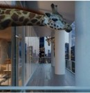
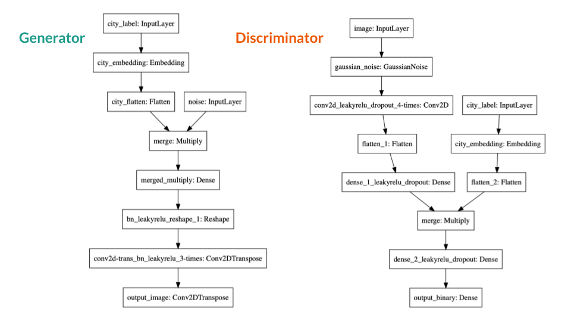
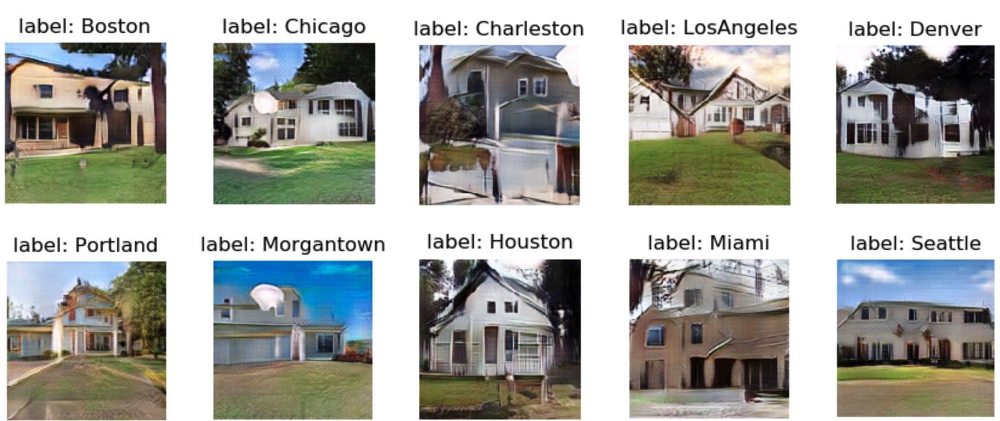

<h1 style="font-size:200%;text-align:center">Generating Photo Realistic Neighbourhoods using Artificial Intelligence</h1>

Before starting, I wanted to give a brief introduction to the project, as well as give a special thanks to the team I worked with. This project was done for realtor.com as a capstone project. The team ([Braden Tam](https://github.com/bradentam), [Florence Wang](https://github.com/fsywang), [Hanying Zhang](https://github.com/HanyingZhang) and [Me](https://github.com/AndresPitta)) was given the task of using image generation to generate realistic pictures of neighbourhoods. The solution will address the issue of having empty thumbnails for some specific pages of the website. It is also worth mentioning that the images are not related to house postings (because we cannot sell a house that does not exist), but it is more related to the aesthetics of the website. Now that we know what the project is about, let's start:

<h3 style="font-size:200%;text-align:center">GANs</h3>

Image generation is a field that has become very popular recently. The tasks of the models in this field is to generate new images from existing dataset. The image generation technique I am going to focus on this post is called Generative Adversarial Networks (Also known as GANs on the streets). This framework is built with 2 opposing networks: one is called the Generator and the other one is called the Discriminator. The idea of the Generator is to generate realistic images, and the idea of the Discriminator is to classify whether these images are real or not. Iteratively, the Generator and the Discriminator are getting information from the dataset until the Generator generates images that are realistic enough to fool the Discriminator.

Or in the words of Tensorflow

If you want to learn more (and see where the image was taken from), please go to this [link](https://www.tensorflow.org/tutorials/generative/dcgan). It's tensorflow's tutorial on GANs.

<h3 style="font-size:200%;text-align:center">The data</h3>

Our capstone partner provided us with around 217,000 images of houses as shown below.   

Most of the pictures contained your typical American house with a big front yard and a family of 8. However, in the dataset we also had images that contained interiors and floorplans, like this one:

And I know that giraffes are really cool. Nonetheless, one problem we saw in the previous post is homogeneity. It seems like when images are not cohesive enough, GANs try to generate images that resemble all of the elements in them. Thus, the team believes that, having a floorplan in the same dataset as an exterior image will result in noisy generated images. To solve this problem, we created 4 clusters as shown here:

For this model, for cohesiveness, we used about 100,000 from the exteriors cluster. This is because these images resemble the images that are already on the website.

<h3 style="font-size:200%;text-align:center">The work</h3>

This bit is a little more technical, for those of you who want a little more detail. As mentioned in the previous post, GANs are made of 2 opposing networks: The Generator and The Discriminator. The Generator is in charge of generating images and the Discriminator is in charge of judging whether these images are real or not. The networks are trained for several epochs, in which for each epoch, the networks become better at doing their job. The goal is that, after several epochs, the Generator generates images realistic enough to fool the discriminator.

For this model, we used a conditional GANs, which means that the input is a city and the output will be a generated image of that city. The architecture we used for the model is the following:

The final model was run for 3200 epochs using a GPU optimized instance in AWS. Which in a few words means that we had to spend almost 20 hours running the model in AWS.

<h3 style="font-size:200%;text-align:center">The results</h3>

Finally, the results. I promise this part is going to be more interesting haha. As I mentioned before, the network was trained for 200 epochs. For each epoch, the generator became better and better at generating never-seen-before images. Here is an example of what I am saying:  

As you can see, by epoch 200th the model learned how a house looks like.

We also checked whether the model was generating novel images, instead of copy-pasting what already was in the dataset. For this, we use cosine similarity to evaluate the closest image from a generated image. Here is an example

In the figure, we can see a generated image on the left and its closest **real** image on the right. As you can see, the image on the left still has a few features from the image on the right. However, it looks different enough to be considered a new house that no one has seen before.

Once we knew it was generating new images, we tested the generation process for each city. Here are the results:

As you can see, this time the images look more realistic compared to the Pokemon project. Some of the images still have white spots and blurry edges that make the image lose its fantasy. However, these results made me really happy.

<h3 style="font-size:200%;text-align:center">Conclusions</h3>

As you can see, this project was successful at generating realistic images of exteriors. Further improvements could include trying to refine the edges by doing more post-processing or incorporating pre-trained networks to improve the quality of the images. 

if you want to learn more, you can contact me through my [linkedin](https://www.linkedin.com/in/andrespitta19/).

Stay tuned for more work!

<h3 style="font-size:200%;text-align:center">References</h3>

Also, here are some useful links we used for reference:

Brownlee, Jason. 2019. "How to Develop a Conditional GAN (cGAN) From Scratch," Machine Learning Mastery (blog), July 5, 2019. [https://machinelearningmastery.com/how-to-develop-a-conditional-generative-adversarial-network-from-scratch/](https://machinelearningmastery.com/how-to-develop-a-conditional-generative-adversarial-network-from-scratch/).

Surma, Greg. 2019. "Image Generator - Drawing Cartoons with Generative Adversarial Networks," Towards data science (blog), February 10, 2019. [https://towardsdatascience.com/image-generator-drawing-cartoons-with-generative-adversarial-networks-45e814ca9b6b](https://towardsdatascience.com/image-generator-drawing-cartoons-with-generative-adversarial-networks-45e814ca9b6b)

Kong, Joash. 2019. "Conditional DCGAN+CNN using 32 Images." July 1, 2019. [https://www.kaggle.com/joashjw/conditional-dcgan-cnn-using-32-images](https://www.kaggle.com/joashjw/conditional-dcgan-cnn-using-32-images)

Xu, Xiaochun. 2019. "CDCGAN_mnist_eager" April 1, 2019. [https://www.kaggle.com/xxc025/cdcgan-mnist-eager](https://www.kaggle.com/xxc025/cdcgan-mnist-eager)

